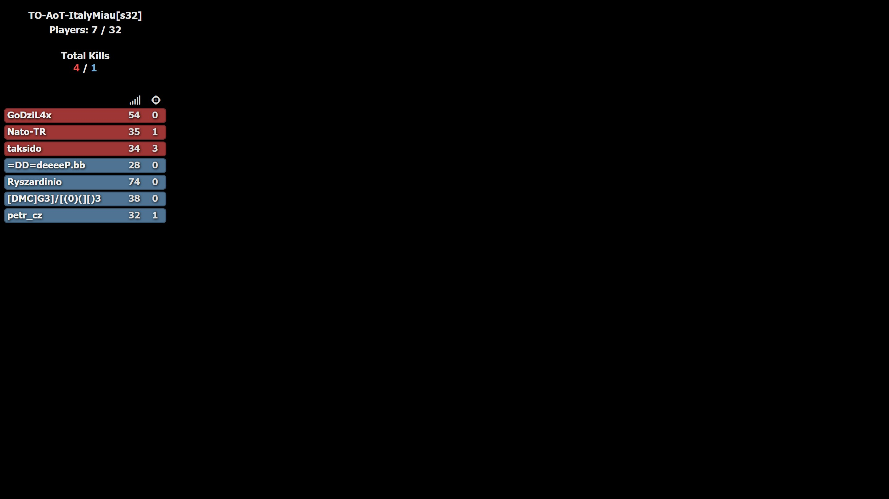

Tactical Ops related staff I've recreated and/or refactored 🙄

-----
`ld_server_stats.html` — LuckyDog's TO server [stats page](https://serverstatus.tacops.de/index.php) (by _LuckyDog_)
> 
-----
OBS [overlays](https://tactical-ops.eu/tactical-ops-tv-overlay.php) used for streaming (by _jo0Oey_)
- `obs_overlay.html` — tune the look 👌🏻
> 
- `obs_hud_overlay.html` — HUD
> | Main mode                                                                 | Legacy mode                                                               |
> |---------------------------------------------------------------------------|---------------------------------------------------------------------------------------|
> |  |  |
- `obs_text_overlay.html` — text (but also fancy)
> | Main mode                                                           | Legacy mode                                                               |
> |---------------------------------------------------------------------------|---------------------------------------------------------------------------------------|
> |  |  |

Features:
- Retrieve server stats from LuckyDog's API
- UI is fully rendered on the client-side
- Url-parameters supported:
  - `ip`, `port`
  - `timeout` — data refresh rate (in seconds)
  - `mode`
    - HUD: `main` (default), `trimmed34`, `trimmed35` or `legacy`
    - text: `full` (default), `basic` or `legacy`
  - `icons` — if it's `true` icons will be shown for player's score, kills, deaths, etc. instead of text labels `S:`, `K:`, etc.

To do:
- Add support for different server versions:
  - [x] [Main](https://tactical-ops.eu/totv/overlays/ld_hud.php?ip=81.169.138.37&port=9777) (powered by LuckyDog API)
  - [ ] Trimmed — less information available, e.g., no Player Status, Round Wins, etc (powered by LuckyDog API)
    - [ ] [TO3.4 Version](https://tactical-ops.eu/totv/overlays/ld_hud_to340.php?ip=81.169.138.37&port=9777)
    - [ ] [TO3.5 Version](https://tactical-ops.eu/totv/overlays/ld_hud_to350.php?ip=81.169.138.37&port=9777)
  - [x] [Legacy](https://tactical-ops.eu/totv/overlays/333n_hud.php?ip=81.169.138.37&port=9777) — 5min update rate and is missing a lot of info (powered by 333 Networks API)
- Add text overlay
  - [x] [Basic](https://tactical-ops.eu/totv/overlays/text/ld_text.php?ip=81.169.138.37&port=9777) (powered by LuckyDog API)
  - [x] [Full](https://tactical-ops.eu/totv/overlays/text/ld_text_full.php?ip=81.169.138.37&port=9777) — Shows more info but requires the server to have LD's updated `UDPServerQuery` (powered by LuckyDog API)
  - [x] [Legacy](https://tactical-ops.eu/totv/overlays/text/333n_text.php?ip=81.169.138.37&port=9777) — 5min update rate and is missing a lot of info (powered by 333 Networks API)

Considerations:
- Should be there any indication on the request fail?
- Should we request data no matter what or stop after certain retry count?
- Should we use defaults rather than `N/A` for absent fields?

### How to use it?

It works without using any web server, just open `file:///path/to/obs_hud_overlay.html?ip=81.169.138.37&port=9777&icons=true` and voilà! ;)